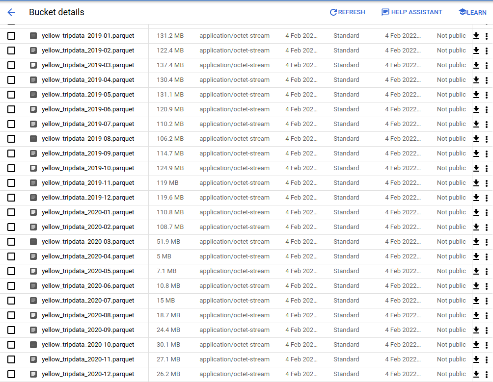

# DEZ Week 2

All of the operations were done using a VM instance. 

# DAGs

For the yellow* and fhv* files, they had to be scheduled every month. So, their schedule interval was set to `"0 6 2 * *"`. For the zone lookup, it only needed to be executed once.

In order to conserve space, another operator was created that removed the csv and parquet files after the latter was uploaded.

```python3
delete_dataset_task = BashOperator(
        task_id="delete_dataset_task",
        bash_command=f"rm -rf {path_to_local_home}/{dataset_file} {path_to_local_home}/{parquet_file}"
    )

```


All DAGs were locally modified.

# Installation
Docker and docker-compose were installed on the VM.

# Copying Files
The docker image (blueprint) was copied from local folder to the VM using 

```bash
gcloud compute scp --recurse /mnt/data/DEZoom/Week2/airflow_hw1/  dtc-de-week2:/home/user/airflow
```

The google credentials were copied using the `sftp` command.

Also, the following command was run

```bash
echo -e "AIRFLOW_UID=$(id -u)" > .env
```

# Building Image and Running

Inside the airflow folder, the following commands were run. These commands were run inside Visual Studio Code, so that port-forwarding could also be enabled.

```bash
docker-compose build
docker-compose up airflow-init
docker-compose up
```

# Screenshots

DAGs inside the running VM


Empty GCS bucket before running DAGs


Successful DAG run for the FHV vehicles


Uploaded data for the FHV vehicles


Successful DAG run for the yellow vehicles


Uploaded data for the yellow vehicles




Successful DAG run for the zones


Uploaded data for the zones


GCP bucket size after uploading data


# Q1

Start date should be `2019-01-01`

# Q2

It needs to be run every month

# Q3

All are green; see third image from top (above)

# Q4

It needs to be run once (since this data doesn't change)